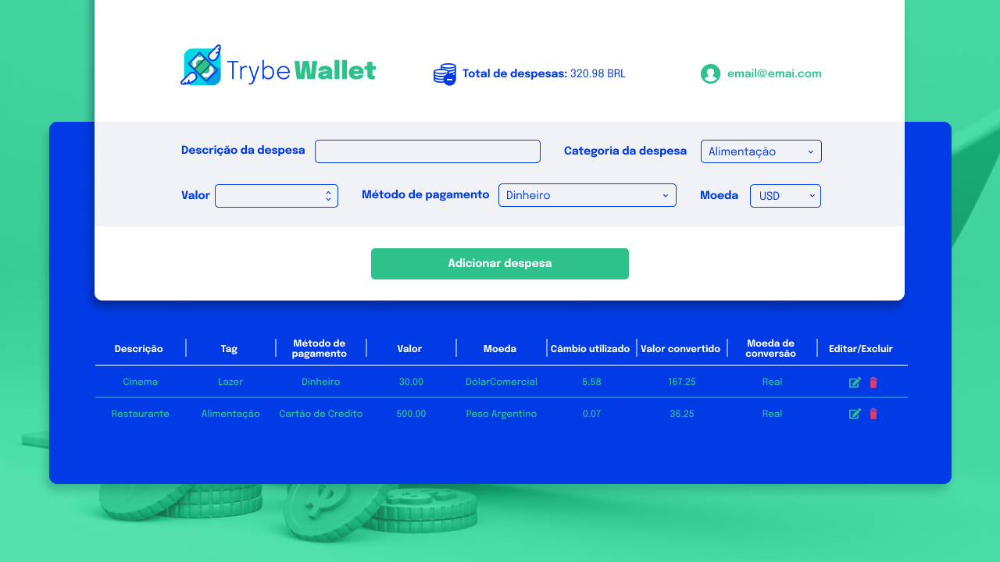

<p align="center">
  
</p>

## 📋 Sobre o projeto
Site para organização de despesas



[](https://www.figma.com/file/ibAEAbS7A6EBprCvXJNhbt/%5BProjeto%5D%5BFrontend%5D-TrybeWallet?node-id=0%3A1&t=FABFQKLUcXnWSjeq-1)

## 💻 Tecnologias
- React
- React Router 
- Redux

## ✨ Funcionalidades 
- Adicionar despesas em cotações diferentes
- Visualizar valor da despesa em cotações diferentes, com base na cotação no horário em que a despesa foi salva
- Editar ou excluir despesa

## 🧠 Aprendizado
Durante esse projeto aprendi a trabalhar com Redux, gereciando estados vindos de uma API de cotação

## 📦 Inicialização
```bash
npm i
```
```bash 
npm start
```
